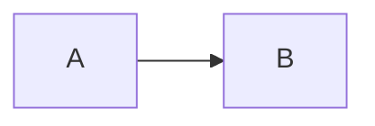
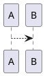

# Architecture for Platform Engineers

Diagram-first **white papers on system design**, written from the perspective of the person
who has to build and operate the platform. High-level structure, workflow, and the tradeoffs
behind the decisions — not low-level config.

📖 **Published site:** https://duychu.github.io/architecture-for-platform-engineer/

## What's inside

- **Diagram-first, low-word papers.** Each paper answers: *what does it look like*, *how does
  it work*, and *what would I get wrong?* The load is carried by diagrams and tables.
- **A reusable template** ([`docs/_TEMPLATE.md`](docs/_TEMPLATE.md)) that bakes in the house
  structure so the series stays consistent.
- **First paper:** [Anatomy of an Internal Developer Platform](docs/platform-engineering/internal-developer-platform.md).

Built with [Docusaurus](https://docusaurus.io/). Diagrams use **Mermaid** (default) and
**PlantUML** (for C4 / deployment / rich component views).

## Run it locally

```bash
npm install      # first time only
npm start        # dev server with hot reload at http://localhost:3000
npm run build    # production build; fails on broken links or invalid diagrams
npm run serve    # preview the production build locally
```

Requires Node.js 18+.

## Diagrams

| Engine | Use it for | How it renders |
| --- | --- | --- |
| **Mermaid** | Flow, sequence, state, decision trees (the default) | Natively in the browser, offline-safe |
| **PlantUML** | C4 (context/container/component), deployment, rich components | **View-time** via a PlantUML server (see below) |

Write diagrams as fenced code blocks:

<pre>



</pre>

### PlantUML rendering — known runtime dependency

PlantUML source is encoded **at build time**, but the rendered image is fetched by the
reader's browser **at view time** from a PlantUML server. The default is the public
`https://www.plantuml.com/plantuml/svg`. This means:

- ✅ Zero build-time infrastructure, simplest possible setup.
- ⚠️ Pages with PlantUML diagrams need network access to that server when viewed, and the
  diagram source is sent to it. For an offline-safe or private setup, self-host a PlantUML or
  [Kroki](https://kroki.io/) server and change `PLANTUML_SERVER` in
  [`docusaurus.config.js`](docusaurus.config.js).

Mermaid has no such dependency — prefer it unless PlantUML is clearly better for the diagram.

## Adding a new paper

1. Copy [`docs/_TEMPLATE.md`](docs/_TEMPLATE.md) into the right theme folder under `docs/`
   (create a new folder for a new theme).
2. Fill in the sections. Keep it diagram-first; always include the *critical questions*.
3. Register it in [`sidebars.js`](sidebars.js) under the matching category.
4. Run `npm run build` to validate diagrams and links before you push.

## Publishing (GitHub Pages)

Publishing is automated by [`.github/workflows/deploy.yml`](.github/workflows/deploy.yml):

- **Pull requests** → the site is built (no deploy), so broken links and invalid diagrams
  fail the check before merge.
- **Push to `main`** → the site is built and deployed to GitHub Pages.

**One-time setup** (in the GitHub repo, cannot be done from code): go to
**Settings → Pages → Build and deployment → Source** and select **GitHub Actions**. After
that, every push to `main` publishes automatically.

## License

See [LICENSE](LICENSE).
