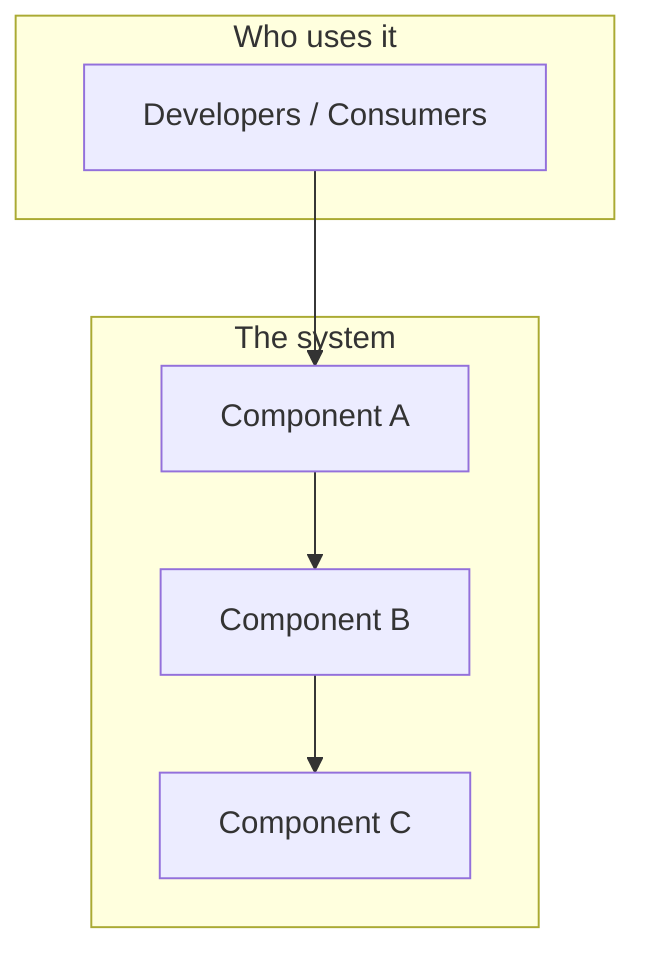
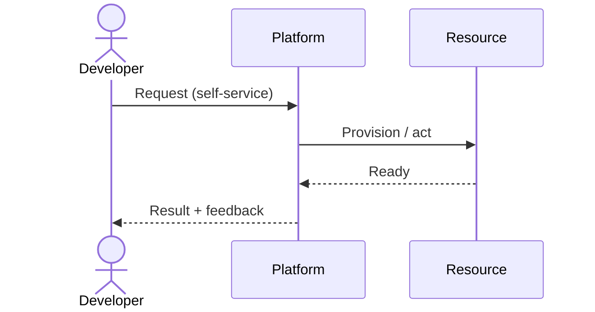
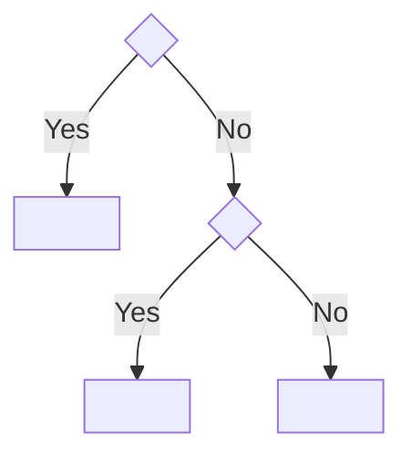
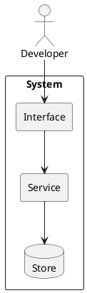

<!--
  WHITE-PAPER TEMPLATE — copy this file, don't edit it in place.

  House rules:
    • Diagram-first. If a picture can carry the idea, let it. Prose = captions + "why".
    • High-level only. Boxes/arrows/flows, NOT config. No Helm/Terraform/YAML dumps.
    • Every paper MUST end with critical thinking: what breaks, what to challenge.

  Diagram engines:
    • Mermaid  → DEFAULT. Flow, sequence, state, class, decision trees, gantt.
    • PlantUML → ONLY when clearly better: C4 (context/container/component),
                 deployment, rich component diagrams. Rendered view-time (see README).
  Delete these comments and all <angle-bracket> placeholders before publishing.
-->

# <Paper title>

## TL;DR

<2–3 sentences. The whole idea, compressed. A reader who stops here should still
walk away with the core mental model.>

## Why it matters (platform lens)

<What problem does this design solve *for the platform team and its users*? Who feels
the pain today, and what does "good" look like? 3–5 sentences or a short bullet list.>

## The Big Picture

<ONE primary diagram of the moving parts. This is the heart of the paper.>

*Caption: one line on how to read the diagram — the thing the reader should notice.*

## How it works

<The key workflow, end to end. Prefer a sequence diagram for request/response or
provisioning flows.>

## Design decisions & tradeoffs

<The decisions that actually matter, as tables. Give a default AND the tension.>

| Decision | Option A | Option B | Default & why |
| --- | --- | --- | --- |
| <Axis 1> | <A> | <B> | <pick + one-line reason> |
| <Axis 2> | <A> | <B> | <pick + one-line reason> |

<Optional: a decision tree for "which path do I take?">

<Use PlantUML instead of Mermaid ONLY for C4 / deployment / rich component views.
Example (delete if unused):>

## Failure modes & critical questions

<The "think like a platform engineer" section. This is mandatory. Do not skip.>

- **What breaks first?** <blast radius, single points of failure>
- **What's the hidden cost?** <cognitive load, operational toil, $$$>
- **What assumption is load-bearing?** <name it — what happens when it's false?>
- **How do we know it's working?** <the signal / metric that proves it, not vibes>
- **What would make me choose the opposite?** <the honest counter-argument>

## Golden-path implementation checklist

<High-level, ordered steps. The "paved road", not the config. Keep it portable.>

1. <Step — what, not how>
2. <Step>
3. <Step>
4. <Step — how you'll measure success>

## Anti-patterns / when NOT to do this

- ❌ **<Anti-pattern>** — <why it bites, what to do instead>
- ❌ **<Anti-pattern>** — <why it bites>
- ⚠️ **Skip this design when** <the conditions where it's overkill or wrong>

## Further reading

- <Source / book / talk — 1 line on why it's worth your time>
- <Source>
