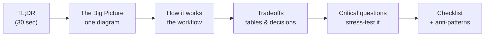

# Architecture for Platform Engineers

> Diagram-first white papers on **system design** — high-level structure, workflow,
> and the tradeoffs behind the decisions. Written from the perspective of the person
> who has to **build and operate the platform**, not just ship one service on it.

## What this is

A growing collection of short, **diagram-led** white papers. Each one takes a system-design
topic and answers three questions a platform engineer actually cares about:

1. **What does it look like?** — one clear picture of the moving parts.
2. **How does it work?** — the workflow, end to end.
3. **What would I get wrong?** — the tradeoffs, failure modes, and questions to challenge
   your own design.

We stay at the level of **structure, flow, and logic**. You will not find Helm values or
Terraform blocks here — you *will* find the mental model you need before you write them.

## How to read a paper (10 minutes, in this order)

- **In a hurry?** Read the TL;DR and stare at the Big Picture diagram. That is 80% of the idea.
- **Making a decision?** Jump to *Design decisions & tradeoffs* and *Critical questions*.
- **About to build?** The *Golden-path checklist* and *Anti-patterns* are your pre-flight.

## The house style

Every paper follows the same spine so you always know where to look. The load is carried by
**diagrams and tables**; prose is kept to captions and connective tissue.

| Principle | What it means here |
| --- | --- |
| Diagram-first | If a picture can say it, the picture says it. Text explains *why*, not *what*. |
| High-level | Boxes, arrows, and flows — not config. Portable across tools and clouds. |
| Opinionated, but honest | We give a default *and* the tradeoff, so you can disagree on purpose. |
| Think, don't copy | Every paper ends by asking what would break. Design is argument, not recipe. |

## The series

| Theme | Status | Papers |
| --- | --- | --- |
| Platform / IDP / Golden Paths | ✅ Live | [Anatomy of an Internal Developer Platform](./platform-engineering/internal-developer-platform.md) |
| Reliability & Observability | 🔜 Planned | SLOs & error budgets, resilience patterns |
| Scalability & Data | 🔜 Planned | Caching, sharding, consistency tradeoffs |
| Delivery: K8s, CI/CD, GitOps | 🔜 Planned | Progressive delivery, GitOps flow |

:::tip Contributing a paper
Copy the template at `docs/_TEMPLATE.md`, drop your paper under the right theme folder in
`docs/`, and add it to `sidebars.js`. See the [README](https://github.com/duychu/architecture-for-platform-engineer#adding-a-new-paper)
for the full workflow.
:::
