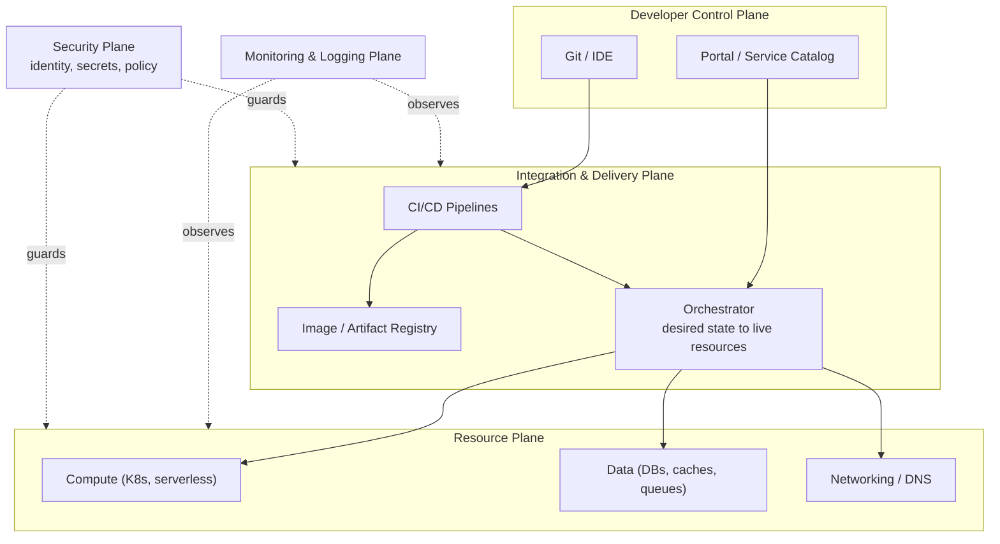
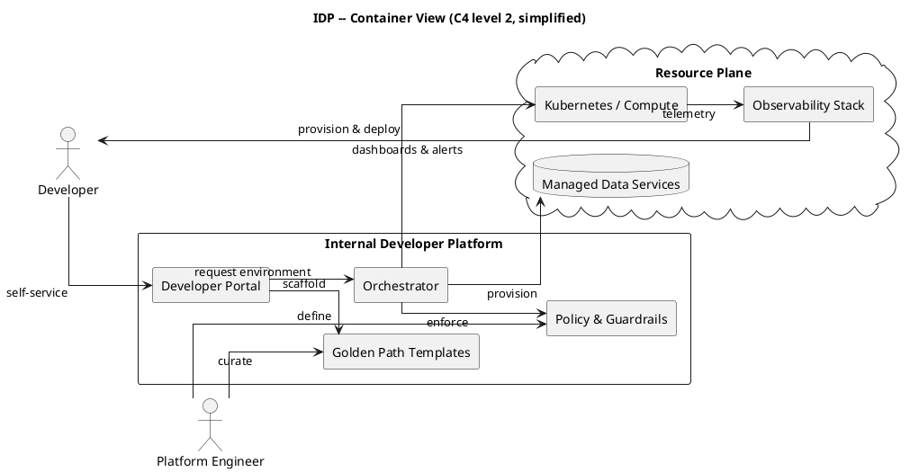
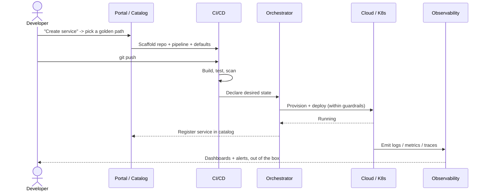
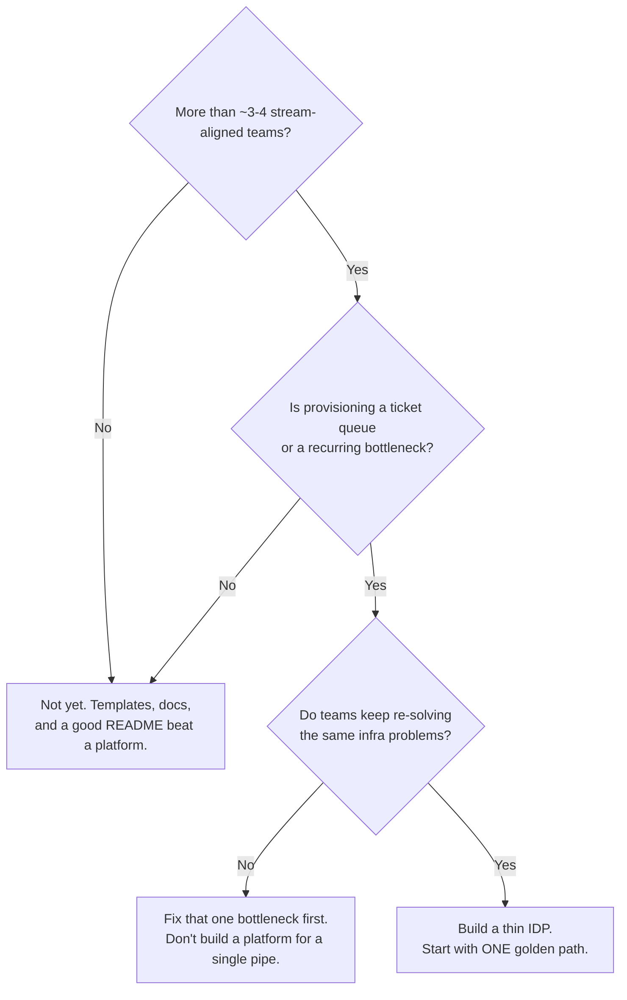

# Anatomy of an Internal Developer Platform

## TL;DR

An **Internal Developer Platform (IDP)** is a *product* the platform team builds for its
developers: a thin, self-service layer over your clouds, clusters, and pipelines that turns
"file a ticket and wait" into "push code and ship." Its job is to encode **golden paths**
(paved roads with guardrails baked in) so the fastest way to build is also the safe,
compliant, observable way.

## Why it matters (platform lens)

As an org grows past a handful of teams, every stream-aligned team starts re-solving the
same problems: how do I get a database, a pipeline, a namespace, an on-call dashboard?
The usual answers both fail:

- **Ticket-ops** — a central team provisions everything by hand. Safe, but a bottleneck.
- **You-build-it-you-run-it, raw** — every team touches Terraform and Kubernetes directly.
  Fast for experts, a cognitive-load disaster for everyone else, and a compliance minefield.

An IDP is the third option: **self-service within guardrails**. The platform team's product
is *developer experience* — measured by how little a developer has to know to do the right
thing.

## The Big Picture

An IDP is best understood as **five planes**. The three in the middle are the delivery path;
two cross-cutting planes (observability, security) apply everywhere.

*Caption: developers touch only the top plane. The orchestrator is the keystone — it takes a
declared "desired state" and makes the lower planes match it, so nobody hand-provisions.*

Here is the same system as a **C4 container view**, showing who talks to what (rendered with
PlantUML):

## How it works

The value shows up as a **golden path**: the scripted, opinionated flow from idea to running
service. Notice how much the developer *doesn't* have to do.

*The developer made two moves — "create service" and `git push`. Everything else is the
platform doing its job.*

## Design decisions & tradeoffs

### Buy vs build

| | Adopt / Buy (Backstage, commercial IDP) | Build (assemble your own) |
| --- | --- | --- |
| Time to value | Fast | Slow |
| Fit to your org | Generic | Exact |
| Maintenance burden | Vendor / community | You, forever |
| **Default** | **Start here** — adopt an existing portal + orchestrator, customize later | Only when you have a genuinely unusual constraint and the team to sustain it |

### The three tensions every IDP negotiates

| Tension | Lean one way… | …and it costs you |
| --- | --- | --- |
| **Opinionated ↔ Flexible** | Opinionated = fast onboarding, easy support | Teams with odd needs feel caged |
| **Self-service ↔ Guardrails** | More guardrails = safer, more compliant | Too many = ticket-ops with extra steps |
| **Golden path ↔ Escape hatch** | A paved road most teams take | Must allow "off-road" or experts route around you |

**Default stance:** opinionated golden paths for the 80% case, with a documented, *supported*
escape hatch for the 20%. A platform with no escape hatch gets bypassed; a platform that is
all escape hatch is just raw infrastructure with a logo.

### Do you even need an IDP yet?

Building a platform too early is a classic waste. Use this to sanity-check:

## Failure modes & critical questions

Treat these as the questions to ask *before* you build, and the ways an IDP quietly dies:

- **What breaks first?** The orchestrator is the keystone — if declared state and live state
  drift, or it goes down mid-provision, every team is blocked. What's the blast radius, and
  can teams deploy when the platform is degraded?
- **What's the hidden cost?** A platform is a *product with users*. If you can't fund a team
  to run it as a product — roadmap, support, docs, on-call — you're building shelfware.
- **What assumption is load-bearing?** That your golden path fits most teams. If it fits only
  the team that built it, adoption stalls. How did you validate the path with *other* teams?
- **How do we know it's working?** Not by launch announcements. By **DORA** (lead time,
  deploy frequency, change-fail rate, MTTR) and **DevEx** signals (time-to-first-deploy for a
  new service, % of services on the golden path, developer satisfaction). If those don't move,
  the platform isn't working — regardless of how elegant it is.
- **What would make me choose the opposite?** A small org, a single dominant workload, or a
  team of infra experts who are *faster* without a layer in the way. Then skip the platform.

## Golden-path implementation checklist

1. **Pick one painful, common journey** (e.g. "stand up a new HTTP service"). Just one.
2. **Talk to the teams who'll walk it** — treat them as customers, not ticket-filers.
3. **Pave that one path end-to-end**: scaffold → pipeline → provision → observe, self-service.
4. **Bake guardrails into the path**, not into a review gate (policy, secrets, cost limits).
5. **Provide an escape hatch** and document it — support the 20%, don't fight them.
6. **Measure adoption and DORA/DevEx** from day one; iterate on what the numbers say.
7. **Run it as a product**: changelog, docs, support channel, and a real owner.

## Anti-patterns / when NOT to do this

- ❌ **The platform nobody adopts** — built in isolation, launched with a mandate, walked by
  no one. Adoption is earned by being the *easiest* path, not the required one.
- ❌ **The gilded cage** — so opinionated there's no escape hatch, so experts route around it
  and you've built a bottleneck with better branding.
- ❌ **Ticket-ops in disguise** — a shiny portal whose every button opens a request that a
  human fulfills. Self-service means the machine does it.
- ❌ **Platform as a side quest** — no dedicated team, no roadmap. It rots the moment its
  champion changes jobs.
- ⚠️ **Skip the platform entirely** when you have only a couple of teams or one dominant
  workload — a template repo and good docs will outperform a platform you can't staff.

## Further reading

- *Team Topologies* (Skelton & Pais) — the "platform team as an enabling product team" model.
- CNCF **Platform Engineering Maturity Model** — a vocabulary for where you are and what's next.
- **platformengineering.org** reference architectures — the five-planes model in more depth.
- Spotify's **"Golden Paths"** and the **Backstage** project — the paved-road idea, in practice.
- *Accelerate* (Forsgren, Humble, Kim) — why DORA metrics are the scoreboard for all of this.
