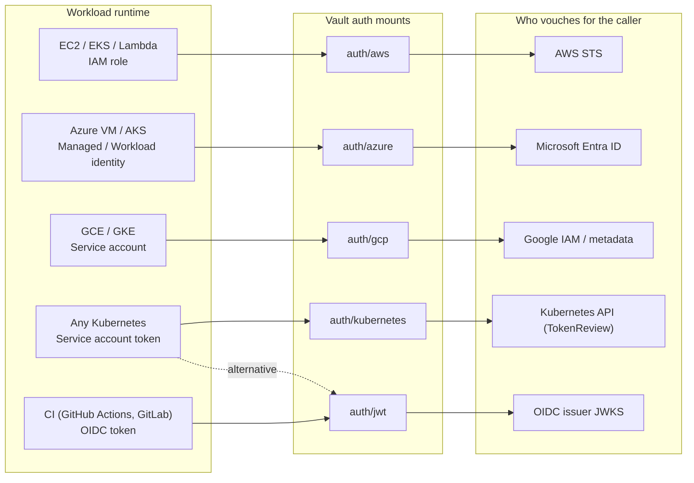
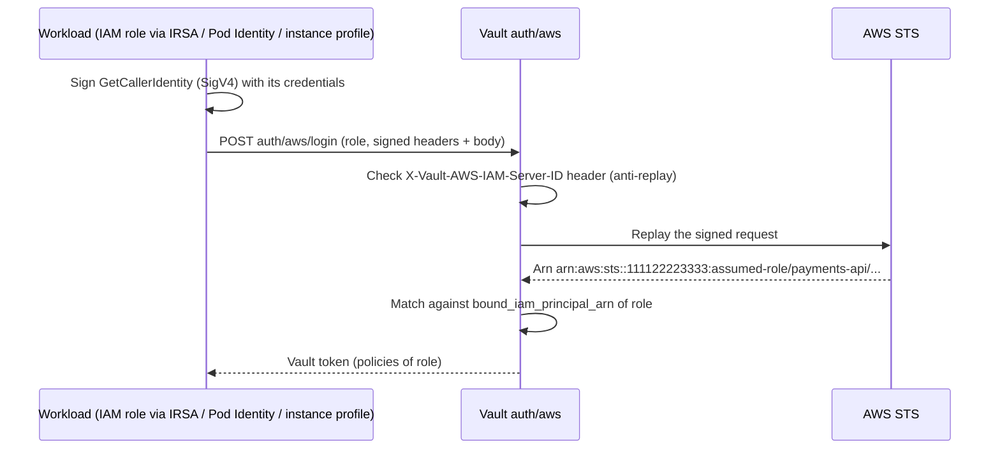
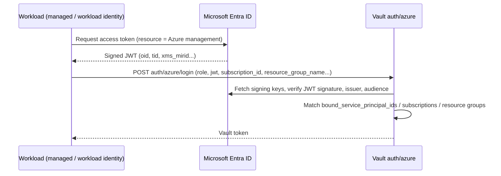
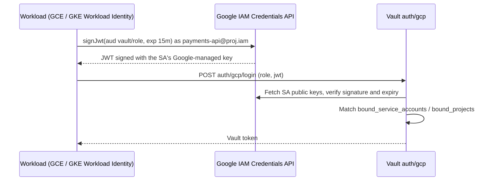
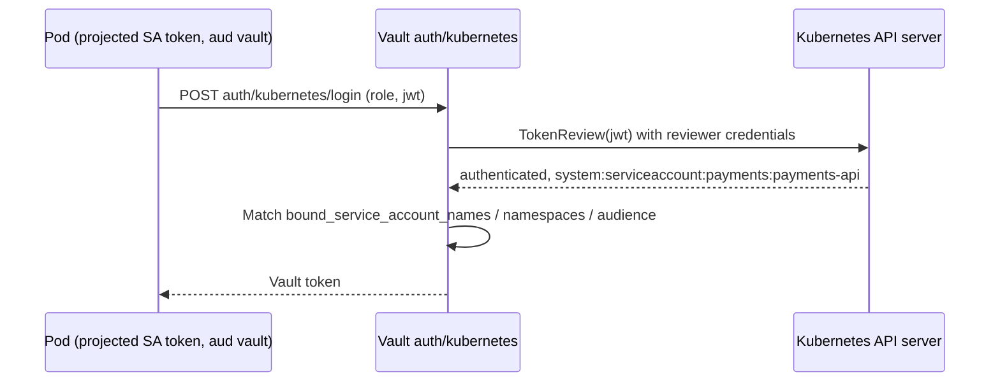
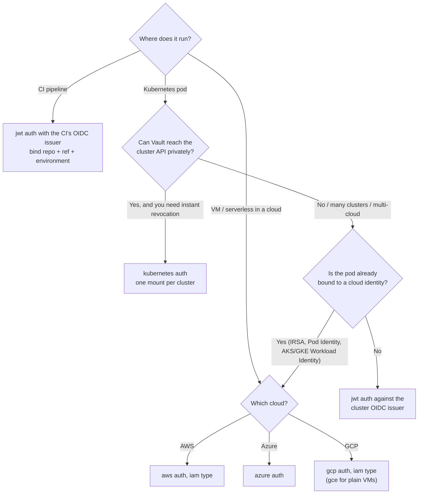

# Authentication with common cloud platforms

## TL;DR

Every cloud already gives your workload an identity — an IAM role, a managed identity, a
service account. Vault's cloud **auth methods** accept *proof* of that identity (a signed
request or a signed JWT), verify it with the cloud's own issuer, and exchange it for a
short-lived Vault token with policies. Nothing secret is pre-installed on the workload, so
there is **no secret zero**. Choosing an auth method is choosing **who Vault trusts to vouch
for the caller** and **which way the network calls flow**.

## Why it matters (platform lens)

Authentication is the part of Vault that teams copy-paste and then never revisit. Get it
wrong and you either:

- hand out a static AppRole secret or token (secret zero is back, now with extra steps), or
- bind roles so loosely (`arn:aws:iam::*:role/*`, any service account in any namespace) that
  policies stop meaning anything.

The platform team's job is to provide **one paved login path per runtime** — EC2/EKS, AKS,
GKE, CI — with bindings narrow enough that "this token belongs to `payments-api` in
`prod`" is actually true.

## The Big Picture



*Caption: the auth method never decides "is this person allowed?" by itself — it asks the
issuer on the right. Vault's own decision is only the **role binding**: which verified
identities map to which policies. Every path ends the same way — a Vault token with a TTL
and policies.*

Every method follows the same three-step contract:

1. **Prove** — the workload presents something only it could produce (a signed STS request,
   a JWT minted for it).
2. **Verify** — Vault validates the proof against the issuer (call STS, check a JWKS
   signature, call TokenReview).
3. **Bind** — Vault matches verified attributes (ARN, object ID, service account, namespace,
   claims) against a **role**, then issues a token with that role's policies and TTL.

## How it works

### AWS — `iam` auth type

The workload signs an `sts:GetCallerIdentity` request with its own credentials but **does
not send it to AWS**. It sends the signed request to Vault, which replays it to STS. If STS
answers, Vault knows exactly which IAM principal signed it.



*Caption: no AWS credential ever reaches Vault — only a one-time signature that STS can
verify. Setting `iam_server_id_header_value` stops a signature captured for one Vault from
being replayed against another.*

The older **`ec2`** auth type verifies the instance identity document instead; prefer
**`iam`** — it works for EC2, ECS, EKS (IRSA or Pod Identity) and Lambda alike.

### Azure — `azure` auth

The workload obtains an **Entra ID access token** for its managed identity (from the VM/VMSS
metadata endpoint or, on AKS, via **Workload Identity**, which exchanges the pod's service
account token for an Entra token). Vault validates the JWT's signature and issuer and can
look up the VM or scale set to confirm it exists.



*Caption: binding on the identity's **object/service principal ID** is the strongest
binding; binding only on a resource group trusts everything that can run there.*

### GCP — `gcp` auth (`iam` and `gce` types)

- **`iam`**: the workload asks Google's IAM Credentials API to **sign a short JWT** as its
  service account (`signJwt`). Vault verifies the signature with the service account's public
  keys. On **GKE Workload Identity** the pod acts as the Google service account, so this works
  from pods.
- **`gce`**: the workload fetches an **instance identity token** from the metadata server;
  Vault can bind on project, zone, instance group or labels.



*Caption: Vault also needs read access to IAM (via its own GCP credentials) to resolve and
check service accounts — another reason the Vault server's own identity matters.*

### Kubernetes — `kubernetes` auth

The pod sends its **service account JWT**. Vault calls the cluster's **TokenReview** API to
ask "is this token valid and who is it?", then binds on service account name and namespace.



*Caption: TokenReview means Vault honours **revocation** — a deleted pod or service account
fails immediately. The price is that Vault must reach every cluster's API server.*

### JWT / OIDC — `jwt` auth

The generic method: Vault verifies any JWT against an issuer's **JWKS** (discovered from an
OIDC discovery URL, a JWKS URL, or static public keys) and binds on claims. Use it for:

- **CI** — GitHub Actions, GitLab and others mint OIDC tokens per job (`repo`, `ref`,
  `environment` claims).
- **Kubernetes without TokenReview** — every modern cluster (EKS, AKS, GKE) publishes an
  OIDC issuer for its service account tokens. Vault validates signatures offline, so it
  needs **no route to the cluster's API**. Trade-off: a token stays valid until it expires
  even if the pod is deleted, so keep projected token TTLs short.

## Design decisions & tradeoffs

### What each method trusts

| Method | Proof presented | Vault verifies with | Typical binding | Network direction | OpenBao |
| --- | --- | --- | --- | --- | --- |
| AWS `iam` | Signed `GetCallerIdentity` | AWS STS (+ IAM to resolve IDs) | IAM role ARN | Vault → AWS APIs | External plugin |
| Azure | Entra access token (JWT) | Entra signing keys (+ ARM lookup) | Service principal / object ID, subscription, RG | Vault → Entra / ARM | External plugin |
| GCP `iam` | JWT signed by Google for the SA | Google public keys (+ IAM) | Service account email, project | Vault → Google APIs | External plugin |
| GCP `gce` | Instance identity token | Google public keys (+ Compute) | Project, zone, instance group, labels | Vault → Google APIs | External plugin |
| Kubernetes | SA token | **TokenReview** on the cluster | SA name + namespace (+ audience) | Vault → **cluster API** | Built in |
| JWT/OIDC | Any OIDC JWT | Issuer JWKS (or static keys) | `sub`, `aud`, custom claims | Vault → issuer (or none) | Built in |

### Which method for my workload?



*Caption: the deciding factors are **reachability** (can Vault call the issuer or cluster?),
**revocation** (do you need TokenReview's instant answer?) and **reuse** (is there already a
cloud identity you would otherwise duplicate?).*

| Decision | Option A | Option B | Default & why |
| --- | --- | --- | --- |
| Pods in a managed K8s | `kubernetes` (TokenReview) | `jwt` / cloud-native identity | **`jwt` or cloud-native** for remote clusters; `kubernetes` when Vault runs in or next to the cluster |
| Mount layout | One shared `auth/kubernetes` | One mount per cluster | **One per cluster** — separate trust config, revocable and auditable per cluster |
| Binding granularity | Namespace wildcard | Exact SA + namespace | **Exact** — a role per workload, generated by your golden path |
| Token TTL | Long (24h+) | Short (≤1h) + renew | **Short** — renewal is cheap, a stolen token is not |

## Hands-on setup

:::info Hands-on exception
Dev-mode lab. The commands configure Vault only; the login steps assume you run them from a
real AWS workload or pod. ARNs and hosts are placeholders.
:::

```bash
export VAULT_ADDR=http://127.0.0.1:8200 VAULT_TOKEN=root
vault policy write payments-read - <<'EOF'
path "apps/data/payments/*" { capabilities = ["read"] }
EOF

# --- AWS iam auth -----------------------------------------------------------
# OpenBao: declare the aws plugin from openbao-plugins in the server config first.
vault auth enable aws
vault write auth/aws/config/client iam_server_id_header_value=vault.example.internal
vault write auth/aws/role/payments-api \
    auth_type=iam \
    bound_iam_principal_arn="arn:aws:iam::111122223333:role/payments-api" \
    token_policies=payments-read token_ttl=1h token_max_ttl=4h
# From the workload (uses its IAM role credentials):
#   vault login -method=aws role=payments-api header_value=vault.example.internal

# --- Kubernetes auth (one mount per cluster) ---------------------------------
vault auth enable -path=k8s-dev kubernetes
vault write auth/k8s-dev/config \
    kubernetes_host="https://k8s-dev.example.internal:6443" \
    kubernetes_ca_cert=@cluster-ca.crt
# Vault outside the cluster + no token_reviewer_jwt => Vault uses the caller's own JWT
# for TokenReview, so the workload's SA needs the system:auth-delegator ClusterRole.
vault write auth/k8s-dev/role/payments-api \
    bound_service_account_names=payments-api \
    bound_service_account_namespaces=payments \
    audience=vault \
    token_policies=payments-read token_ttl=1h
# From the pod:
#   vault write auth/k8s-dev/login role=payments-api \
#       jwt=@/var/run/secrets/tokens/vault-token
```

Creating `payments-api` with `bound_iam_principal_arn` makes Vault resolve the ARN to IAM's
internal unique ID (`resolve_aws_unique_ids=true`, the default), so **Vault itself needs AWS
credentials** with `iam:GetRole`. That is a feature: a deleted-and-recreated role with the
same name will not inherit access. Part 3 shows how this works across accounts.

## Failure modes & critical questions

- **What breaks first?** The issuer path. STS throttling, an expired Kubernetes reviewer
  token, a rotated CA certificate, or a blocked egress rule to Entra/Google turns into a
  fleet-wide login outage. Alert on login *failure rate per mount*.
- **What's the hidden cost?** Role sprawl. One role per workload per cluster per cloud is
  correct — and unmanageable by hand. Generate roles from your service catalog or IaC.
- **What assumption is load-bearing?** That the cloud identity itself is tight. If ten
  services share one IAM role or one Kubernetes service account, Vault cannot tell them
  apart — it faithfully gives all ten the same access.
- **How do we know it's working?** Every Vault token in the audit log maps to a single
  workload; there are **zero** static tokens or AppRole secret IDs in CI variables.
- **What would make me choose the opposite?** For a handful of on-prem hosts with no cloud
  identity, AppRole (with response-wrapped secret IDs delivered by your config management)
  can be the pragmatic answer.

## Golden-path implementation checklist

1. Inventory runtimes (EC2/EKS, AKS, GKE, CI, on-prem) and pick **one** auth method per runtime.
2. Mount auth methods **per trust domain** (per cluster, per CI org), never one shared mount.
3. Bind roles on the **narrowest stable attribute** (role ARN, SA + namespace, object ID).
4. Keep Vault token TTLs short; let agents renew.
5. Generate roles from the service catalog / IaC — no hand-made roles.
6. Measure: login success rate per mount, number of static tokens remaining (target: 0).

## Anti-patterns / when NOT to do this

- ❌ **Wildcard bindings** (`role/*`, `bound_service_account_names=*`) — anyone who can run
  a pod or assume a role gets your policies.
- ❌ **One `auth/kubernetes` mount for all clusters** — you cannot rotate one cluster's CA or
  revoke one cluster without touching all of them.
- ❌ **AppRole secret IDs in CI variables** — a static secret with extra hops; use the CI's OIDC
  token with `jwt` auth.
- ❌ **`ec2` auth for new workloads** — `iam` covers more runtimes and is simpler to reason about.
- ⚠️ **Skip cloud-native auth when** the workload has no platform identity at all; fix that
  first (IRSA / Pod Identity / Workload Identity) rather than inventing a Vault-side workaround.

## Further reading

- [AWS auth method](https://developer.hashicorp.com/vault/docs/auth/aws) — `iam` vs `ec2`,
  cross-account STS and unique-ID resolution.
- [Kubernetes auth method](https://developer.hashicorp.com/vault/docs/auth/kubernetes) — reviewer
  JWT options and short-lived tokens.
- [Use Kubernetes as an OIDC provider](https://developer.hashicorp.com/vault/docs/auth/jwt/oidc-providers/kubernetes) —
  the JWT-auth alternative and its revocation trade-off.
- [Azure](https://developer.hashicorp.com/vault/docs/auth/azure) and
  [GCP](https://developer.hashicorp.com/vault/docs/auth/gcp) auth methods.
- [openbao-plugins](https://github.com/openbao/openbao-plugins) — where OpenBao's cloud plugins live.
- Next: [Part 3 — Integration patterns](./integration-patterns.md)
