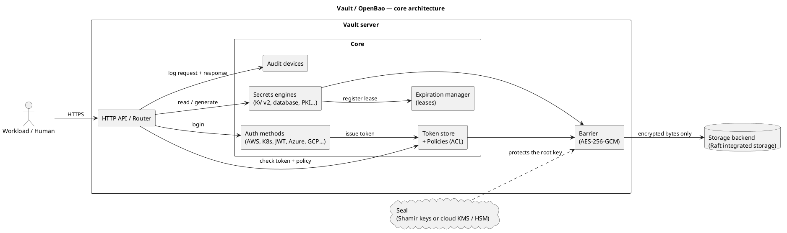
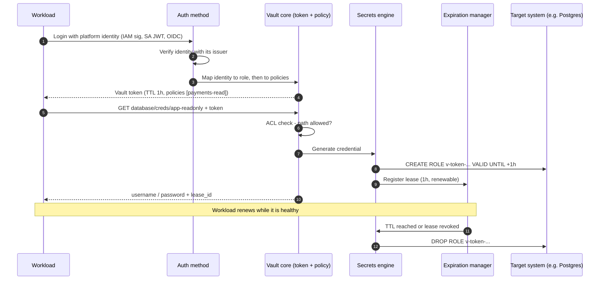
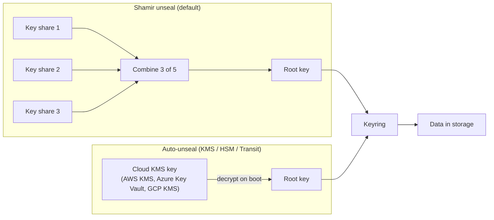
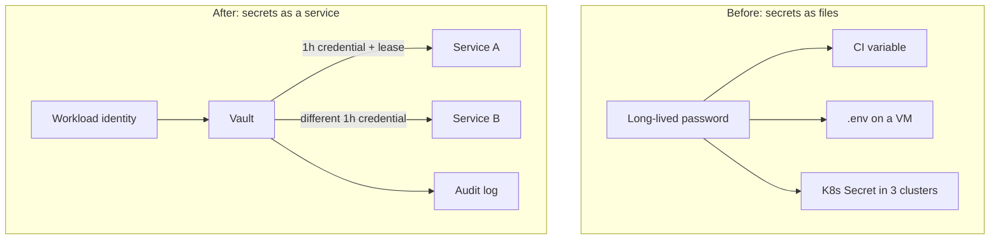

# How Vault works & why it's everywhere

## TL;DR

Vault (and its MPL-licensed fork **OpenBao**) is an **identity broker for secrets**. A client
proves *who it is* to an **auth method**, gets a short-lived **token** carrying **policies**,
and uses that token to read from or generate secrets in a **secrets engine**. Everything
Vault stores sits behind an encryption **barrier** whose key is protected by a **seal**, and
every secret it hands out can carry a **lease** that expires or is revoked. Identity in,
time-boxed secret out, every step audited — that is the whole model.

## Why it matters (platform lens)

Without a secrets platform, secrets **sprawl**: database passwords in CI variables, cloud keys
in `.env` files, the same credential shared by twelve services and never rotated because
nobody knows who uses it. The platform team feels it as:

- **No inventory** — you cannot answer "who can read the payments DB password?"
- **No rotation** — rotating means a coordinated outage, so it never happens.
- **No revocation** — a leaked key is valid until a human finds every copy.
- **No audit** — you learn about access from the breach report, not from a log.

Vault changes the unit of trust from **"who has the secret"** to **"who is this workload"**.
Secrets become something a workload *requests* with its identity, for a bounded time, under
a policy — instead of something it *carries*.

## The Big Picture

Five building blocks, one request path. Learn these and every Vault feature becomes a
variation on them.



*Caption: everything to the right of the barrier is ciphertext. The storage backend — Raft
disks, snapshots, backups — never sees a plaintext secret. The seal decides whether the
barrier can be opened at all.*

| Building block | What it is | The one thing to remember |
| --- | --- | --- |
| **Barrier & seal** | All data is encrypted with a keyring; the keyring is encrypted by a root key; the root key is protected by the **seal** | A *sealed* Vault knows where its data is but cannot read it |
| **Auth methods** | Plugins that verify an external identity (IAM role, K8s service account, OIDC user) | They don't store secrets — they **map identity to policies** |
| **Tokens** | The session credential every request carries | Every token has a TTL and policies; child tokens die with their parent |
| **Policies** | Path-based ACLs (`read`, `create`, `update`, `delete`, `list`, `deny`) | **Default deny.** No policy, no access — including for engines you just mounted |
| **Secrets engines** | Plugins mounted at a path that store, generate or encrypt data | Static (KV) or **dynamic** (database, cloud, PKI) — dynamic ones issue leases |
| **Leases** | A TTL + revocation handle attached to dynamic secrets and tokens | Revoke the lease ⇒ Vault deletes the credential at the source |
| **Audit devices** | Append-only log of every request and response (values HMAC'd) | If **no** audit device can write, Vault **refuses requests** — by design |

## How it works

### The request lifecycle



*Caption: step 1 is the only place a workload proves who it is. After that, everything is a
token with policies and a clock. Step 13 is what makes dynamic secrets safe — Vault cleans up
after itself.*

### Seal and unseal

Vault starts **sealed**. To unseal, it must reconstruct the **root key** that decrypts the
keyring. There are two ways to do that, and the choice drives your entire on-call story.



*Caption: Shamir needs **humans** on every restart; auto-unseal moves that trust to an IAM
permission on a KMS key. Recovery keys still exist with auto-unseal, but they cannot
unseal — they authorise root-level operations such as generating a root token.*

| | Shamir key shares | Auto-unseal (cloud KMS / HSM) |
| --- | --- | --- |
| Restart / node replacement | A quorum of key holders must act | Automatic |
| Trust anchor | People and their key custody | IAM policy on the KMS key |
| Failure mode | Pager storm at 3 a.m. after a reboot | KMS key deleted or IAM broken ⇒ **cannot unseal, ever** |
| **Default** | Labs and air-gapped sites | **Production in the cloud** — protect the KMS key like the crown jewel it is |

## Why Vault became the default



*Caption: the left side has one secret and three uncontrolled copies; the right side has no
shared secret at all — every consumer gets its own, attributable, expiring credential.*

1. **Identity-based access.** Workloads authenticate with what the platform already knows —
   IAM roles, Kubernetes service accounts, OIDC — so there is no "secret zero" to distribute.
2. **Dynamic secrets.** Credentials are created on demand, unique per consumer, and destroyed
   on expiry. A leak has a blast radius of one workload and one hour.
3. **Leases and revocation.** "Revoke everything issued to this role" is one API call.
4. **One control plane across clouds.** The same API, policy language and audit trail on AWS,
   Azure, GCP, on-prem and Kubernetes — the reason it dominates multi-cloud estates.
5. **Pluggable.** Auth methods and engines are plugins; there is one for almost every
   database, cloud and identity provider.
6. **Audit by default.** Every request is logged with the identity behind it.
7. **API-first.** Everything is HTTP + JSON, so it is automatable with Terraform, operators
   and CI — a natural fit for a platform team's golden paths.

## Vault vs OpenBao

In **August 2023** HashiCorp relicensed Vault from MPL-2.0 to the **Business Source
License (BSL 1.1)**. **OpenBao** forked the last MPL release (the 1.14 line) under the
Linux Foundation — it now lives under the **OpenSSF** — and shipped its first GA release,
**v2.0.0, in July 2024**. IBM completed its acquisition of HashiCorp in February 2025, and
Vault moved to IBM's versioning with **Vault 2.0** in 2026. As of this writing the current
lines are Vault **2.1** and OpenBao **2.6**.

| Area | Vault Community | Vault Enterprise / HCP | OpenBao |
| --- | --- | --- | --- |
| Licence | BSL 1.1 (source-available) | Commercial | **MPL-2.0** (OSI open source) |
| Core model, API, CLI | ✅ | ✅ | ✅ compatible (`bao` CLI, same paths) |
| Raft HA, auto-unseal | ✅ | ✅ | ✅ |
| Namespaces (multi-tenancy) | ❌ | ✅ | ✅ (since 2.3, plus per-namespace seals in 2.6) |
| Standby nodes serving reads | ❌ | ✅ (performance standbys) | ✅ (since 2.5) |
| DR / performance replication | ❌ | ✅ | ❌ — use Raft snapshots + standby cluster |
| Sentinel, FIPS builds, vendor SLA | ❌ | ✅ | ❌ (community + third-party support) |
| AWS / Azure / GCP auth & engines | Built in | Built in | **External plugins** (`openbao-plugins`), declared in config since 2.5 |
| Kubernetes, JWT/OIDC, KV, database | Built in | Built in | Built in |

| Decision | Choose Vault | Choose OpenBao | Default & why |
| --- | --- | --- | --- |
| Licence & procurement | You can live with BSL or will buy Enterprise | You need an OSI licence or vendor neutrality | **OpenBao** if licence matters; it is a non-issue for internal use of Vault Community |
| Multi-region DR | You need replication | You can run snapshot-based DR | **Vault Enterprise** if RPO must be near zero across regions |
| Multi-tenancy | Enterprise budget | No budget, need namespaces | **OpenBao** — namespaces are free |
| Ecosystem & docs | Largest | Smaller but compatible | Either — most Vault docs apply to OpenBao verbatim |

:::note Everything else in this series applies to both
When this series says "Vault", read "Vault or OpenBao". Where behaviour differs (mostly
plugin packaging and Enterprise-only features) the text calls it out.
:::

## Hands-on setup

:::info Hands-on exception
This series relaxes the house "no config" rule for one short lab per paper. Dev mode only —
never production.
:::

Start a throwaway server and look at the five building blocks.

```bash
# Terminal 1 — in-memory, auto-unsealed dev server with a known root token
vault server -dev -dev-root-token-id=root          # OpenBao: bao server -dev ...

# Terminal 2
export VAULT_ADDR=http://127.0.0.1:8200 VAULT_TOKEN=root

vault status                 # Sealed=false, Storage Type=inmem
vault auth list              # token/ is always there
vault secrets list           # secret/ (KV v2) is pre-mounted in dev mode
vault audit enable file file_path=/tmp/vault-audit.log

# A token with a narrow policy and a clock
vault policy write demo-read - <<'EOF'
path "secret/data/demo" { capabilities = ["read"] }
EOF
vault kv put secret/demo hello=world
T=$(vault token create -policy=demo-read -ttl=10m -field=token)
VAULT_TOKEN=$T vault kv get secret/demo            # allowed
VAULT_TOKEN=$T vault kv put secret/demo hello=x    # 403 permission denied
vault token lookup "$T"                            # ttl, policies
vault token revoke "$T"
tail -n 2 /tmp/vault-audit.log                     # every call above, values HMAC'd
```

## Failure modes & critical questions

- **What breaks first?** Vault is **tier-0**: if it is down or sealed, every new pod, every
  CI job and every credential renewal fails. Cached tokens and unexpired leases buy you
  minutes to hours — know exactly how many.
- **What's the hidden cost?** Operating it. Upgrades, Raft snapshots, unseal and recovery
  key custody, audit log storage, plugin versions, and on-call for a system everyone
  depends on. Budget a team, not a side project.
- **What assumption is load-bearing?** That the **seal** is recoverable. Deleting the KMS key
  or losing a Shamir quorum makes the data permanently unreadable — test recovery before you
  need it.
- **How do we know it's working?** Login success rate per auth mount, request latency,
  lease count over time (a runaway count is an outage in waiting), token creation rate,
  audit device health, and seal status on every node.
- **What would make me choose the opposite?** A small, single-cloud estate that only needs
  static secrets is often better served by the cloud's native secret manager (AWS Secrets
  Manager, Azure Key Vault, GCP Secret Manager) plus workload identity — no tier-0 service
  to run.

## Golden-path implementation checklist

1. Decide **Vault vs OpenBao** and **who operates it** — before writing any config.
2. Run a 3- or 5-node **Raft** cluster across failure domains with **auto-unseal**.
3. Enable **at least two audit devices** on different sinks.
4. Revoke the initial root token; store recovery keys with named custodians.
5. Onboard workloads only through **identity-based auth** (Part 2) — no static tokens.
6. Start with KV v2 (Part 4), then move high-value credentials to **dynamic** engines (Part 5).
7. Measure: % of secrets that are dynamic, mean credential lifetime, time-to-revoke.

## Anti-patterns / when NOT to do this

- ❌ **Vault as a fancy password file** — static KV secrets with infinite TTLs only move
  sprawl into Vault. Pair KV with rotation, or use dynamic engines.
- ❌ **Long-lived root or periodic tokens in CI** — that is a new secret zero. Use JWT/OIDC
  auth from the CI platform.
- ❌ **One policy for everyone** — `path "*"` grants make the audit log meaningless.
- ❌ **Dev mode, or a single node, "for now"** — it becomes production the day a team depends
  on it.
- ⚠️ **Skip Vault when** you are single-cloud, have a handful of services, need only static
  secrets, and have no one to run a tier-0 service. The cloud-native secret manager wins.

## Further reading

- [Vault architecture](https://developer.hashicorp.com/vault/docs/internals/architecture) —
  the barrier, core and storage in HashiCorp's words.
- [Seal / unseal concepts](https://developer.hashicorp.com/vault/docs/concepts/seal) —
  Shamir, auto-unseal and recovery keys.
- [OpenBao documentation](https://openbao.org/docs/) — the fork's docs, including its
  plugin and namespace model.
- [Lease, renew and revoke](https://developer.hashicorp.com/vault/docs/concepts/lease) —
  the mechanism behind every dynamic secret.
- Next: [Part 2 — Authentication with common cloud platforms](./auth-methods-cloud.md)
