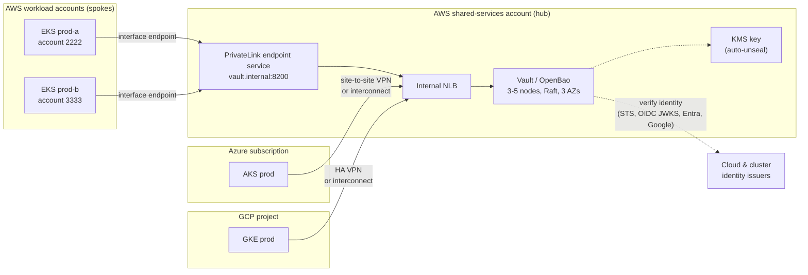
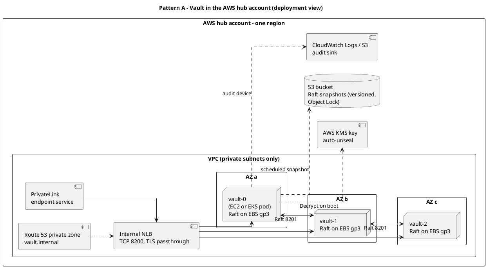
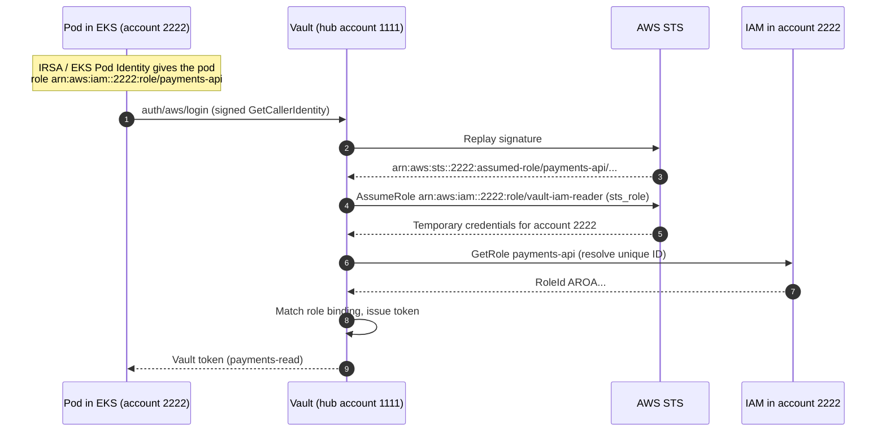
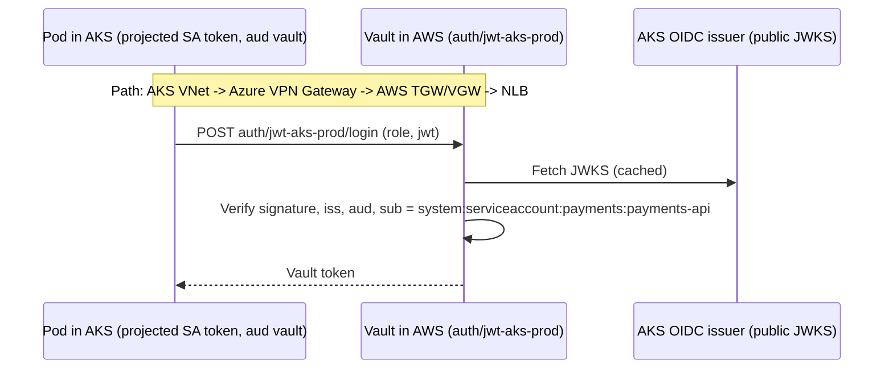
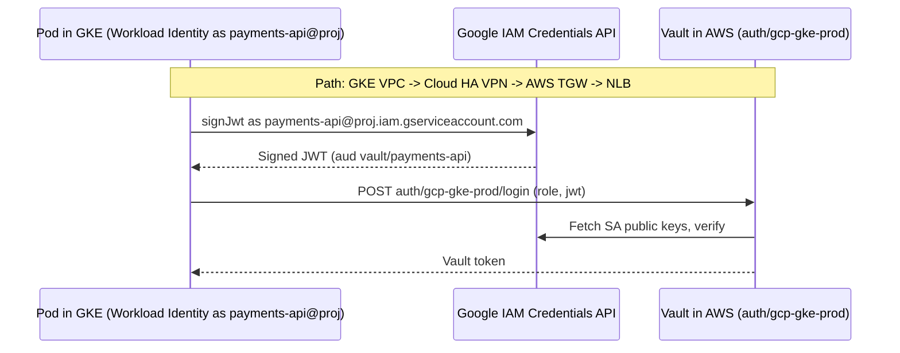
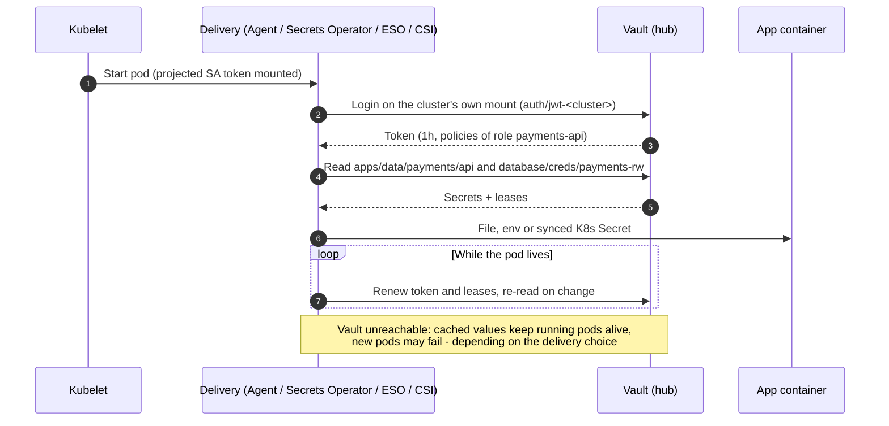
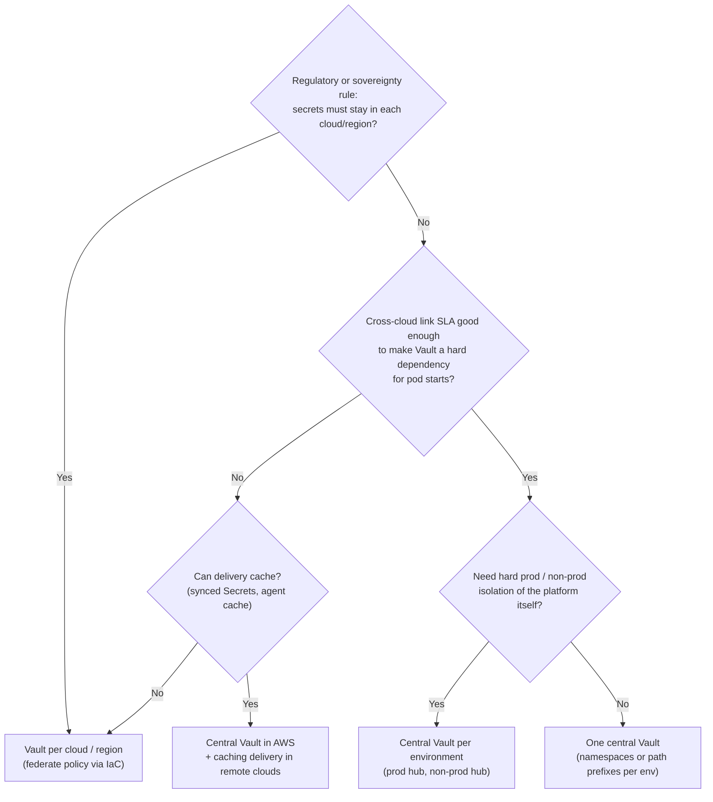

# Integration patterns: Vault in AWS, Kubernetes everywhere

## TL;DR

The most common real-world shape is **one Vault cluster in a shared-services AWS account**
serving Kubernetes clusters that live **in other AWS accounts, in Azure (AKS) and in GCP
(GKE)**. Make it work with three decisions:

1. **Network** — give every cluster a *private, one-way* path to Vault (PrivateLink inside
   AWS, VPN or interconnect across clouds).
2. **Identity** — give every cluster its **own auth mount** and prefer auth that needs **no
   path from Vault back into the cluster**: JWT against the cluster's OIDC issuer, or the
   cloud's native identity (IRSA/Pod Identity, AKS/GKE Workload Identity).
3. **Blast radius** — decide what happens to pods in Azure when the AWS link is down. Delivery
   that caches (synced Kubernetes Secrets, agent caches) turns a Vault outage into a
   "no new secrets" event instead of a "no new pods" event.

## Why it matters (platform lens)

Multi-account and multi-cloud estates rarely start that way — they accrete. A team builds an
AKS cluster for a client, an acquisition brings GKE, every product line gets its own AWS
account. The secrets story fragments with them: Azure Key Vault here, AWS Secrets Manager
there, a Kubernetes Secret checked into a repo somewhere. A central Vault gives you **one
policy language, one audit trail and one onboarding path** — but only if the integration is
designed rather than improvised cluster by cluster.

## The Big Picture



*Caption: all arrows from workloads point **into** the hub — clusters call Vault, Vault does
not call clusters. The only outbound calls Vault makes are to **identity issuers** (and,
for the database engine, to the databases it manages).*

## Pattern A — Vault hosted in AWS



*Caption: TLS terminates **on the Vault nodes** (the NLB only forwards TCP), so the NLB never
sees a token or a secret. Odd node counts across three AZs keep Raft quorum through the loss
of any single AZ.*

| Decision | Option A | Option B | Default & why |
| --- | --- | --- | --- |
| Compute | EC2 Auto Scaling group (one node per AZ) | EKS cluster dedicated to Vault | **EC2** if the team is not already fluent in running stateful sets; **EKS** if you are, and want Helm-based upgrades. Never share the cluster with workloads it serves |
| Storage | Raft integrated storage | External (Consul, DynamoDB) | **Raft** — one system to run, built-in snapshots |
| Unseal | AWS KMS auto-unseal | Shamir | **KMS** — with a key policy that only Vault's role can use, and deletion protection |
| Exposure | Internal NLB + PrivateLink | Public endpoint + allowlist | **Private** — expose publicly only if a cloud cannot get a private path, and then with mTLS |
| DR | Raft snapshots to S3 + restore runbook | Vault Enterprise DR replication | **Snapshots** (works for Vault Community and OpenBao); replication when RPO must be ~0 |

## Pattern B — EKS in other AWS accounts

Two separate problems: **reaching** Vault from a spoke VPC, and **proving** which workload
is calling.

### Reaching Vault

| | PrivateLink (interface endpoint per spoke VPC) | Transit Gateway / VPC peering |
| --- | --- | --- |
| Direction | **One-way**: spoke → Vault only | Two-way routing |
| Overlapping CIDRs | Fine | Must not overlap |
| Vault can call into the spoke | ❌ | ✅ (needed for `kubernetes` auth to a private API server, or for the **database engine** to reach an RDS in the spoke) |
| Blast radius | Minimal | Larger — routing between whole networks |
| **Default** | **PrivateLink** for auth + reads | **Add TGW** only for the specific Vault → spoke paths you need |

### Proving identity — three options



*Caption: the **login** itself (steps 1–3) works cross-account with no extra setup — STS
answers for any account. Steps 4–7 are why you configure `auth/aws/config/sts/<account>`:
Vault assumes a read-only role in each spoke to resolve and pin the caller's IAM unique ID.*

| Option | How it works | Needs Vault → cluster path? | Revocation | Best when |
| --- | --- | --- | --- | --- |
| **1. AWS `iam` auth** (IRSA / Pod Identity) | Pod signs STS request with its IAM role | No (Vault → STS/IAM only) | IAM role deleted ⇒ login fails | The pod already has an IAM role for AWS APIs — reuse it |
| **2. `jwt` auth** vs the cluster's OIDC issuer | Vault verifies the projected SA token with the EKS issuer's public JWKS | No (Vault → public issuer URL) | Token valid until expiry | Default for pods without an IAM role; same pattern for every cloud |
| **3. `kubernetes` auth** (TokenReview) | Vault calls the cluster's API server | **Yes** (TGW / peering to the private API endpoint) | Immediate | Strong revocation requirement and network allows it |

## Pattern C — AKS in Azure



*Caption: the AKS cluster needs the **OIDC issuer** feature enabled; its issuer URL looks like
`https://<region>.oic.prod-aks.azure.com/<tenant-id>/<guid>/`. Vault fetches signing keys over
the internet (or via your egress proxy), never from inside the cluster.*

- **Connectivity:** site-to-site VPN between an Azure VPN Gateway and an AWS Transit
  Gateway (or a partner interconnect for steady volume). Point a private DNS record for
  `vault.internal` at the NLB.
- **Identity:** `jwt` auth against the AKS issuer (default — identical to EKS and GKE), or
  the `azure` auth method with **AKS Workload Identity** when the pod already has an Entra
  identity you want to reuse (in OpenBao, `azure` is an external plugin).

## Pattern D — GKE in Google Cloud



*Caption: with GKE Workload Identity the pod acts as a Google service account, so `gcp` auth
(`iam` type) works unchanged from a pod. Alternatively use `jwt` auth with the cluster issuer
`https://container.googleapis.com/v1/projects/<project>/locations/<location>/clusters/<name>`.*

- **Connectivity:** GCP **HA VPN** to AWS (natively supported pairing) or a partner
  interconnect.
- **Identity:** `jwt` auth against the GKE issuer (consistent with every other cluster), or
  `gcp` auth when the pod already has a Google service account for GCP APIs.

## How it works — one pod start, end to end



*Caption: the delivery component, not the app, carries the Vault integration. That keeps
apps cloud-agnostic and puts retries, caching and renewal in one place.*

| Delivery | Where secrets end up | Survives a Vault outage? | Notes |
| --- | --- | --- | --- |
| Vault Agent injector (sidecar) | Files in a shared volume | Running pods: yes (cached). New pods: no | Per-pod login, flexible templating |
| Vault Secrets Operator (HashiCorp) | Kubernetes `Secret` | **Yes** — Secret persists | Secret is now in etcd; encrypt etcd |
| External Secrets Operator | Kubernetes `Secret` | **Yes** | Vendor-neutral, many backends |
| Secrets Store CSI driver | Mounted volume (optionally synced Secret) | Running pods: yes. New pods: no | No Secret in etcd unless you opt in |

Detail — templating, rotation and policy design — is in
[Part 6](./policies-and-delivery.md).

## Design decisions & tradeoffs

### Per-cluster mounts and naming

One auth mount per cluster gives each cluster its own issuer/CA config, a clean revocation
switch (`vault auth disable auth/jwt-aks-prod`) and audit logs that say *which cluster*
logged in.

| Item | Convention | Example |
| --- | --- | --- |
| Auth mount | `<method>-<cloud>-<env>-<region>-<n>` | `auth/jwt-eks-prod-euw1-a`, `auth/jwt-aks-prod-weu`, `auth/gcp-gke-prod-ew1` |
| Role | `<service>` (same name on every mount) | `payments-api` |
| Policy | `<service>-<env>-<access>` | `payments-prod-read` |
| KV path | `<env>/<team>/<service>/...` | `prod/payments/api` |

Because the role name is the same everywhere, a service that moves from EKS to AKS keeps its
policy — only the mount changes. Link the per-cluster logins to one **identity entity** per
service when you want a single audit identity across clouds.

### Where should Vault live?



| Topology | Blast radius | Latency & egress | Ops cost | Default & why |
| --- | --- | --- | --- | --- |
| **One central Vault (AWS)** | Everything | Cross-cloud RTT on every login/read; cross-cloud egress | Lowest — one cluster | **Start here**, with caching delivery for AKS/GKE |
| **Vault per environment** | One environment | Same as central | 2× | When non-prod experiments must never touch prod Vault |
| **Vault per cloud / region** | One cloud | Local | N× clusters, policy drift risk | When sovereignty or link reliability demands it; manage all with the same IaC |

:::caution Replication is the dividing line
Vault **Enterprise** can replicate between clusters (performance and DR replication), which
makes "one logical Vault, many regional clusters" possible. **Vault Community and OpenBao
cannot.** With them, "Vault per cloud" means independent clusters configured from the same
code, and DR means **Raft snapshot + restore** into a standby cluster.
:::

## Hands-on setup

:::info Hands-on exception
Dev-mode lab, placeholder account IDs and URLs. The OIDC discovery call needs a real
issuer, so run it against one of your clusters.
:::

**1. One JWT mount per cluster.** Get each cluster's issuer URL:
`aws eks describe-cluster --query cluster.identity.oidc.issuer`,
`az aks show --query oidcIssuerProfile.issuerUrl`, or the GKE format shown above.

```bash
export VAULT_ADDR=http://127.0.0.1:8200 VAULT_TOKEN=root

vault auth enable -path=jwt-eks-prod-euw1-a jwt
vault write auth/jwt-eks-prod-euw1-a/config \
    oidc_discovery_url="https://oidc.eks.eu-west-1.amazonaws.com/id/EXAMPLED539D4633E53DE1B71EXAMPLE" \
    bound_issuer="https://oidc.eks.eu-west-1.amazonaws.com/id/EXAMPLED539D4633E53DE1B71EXAMPLE"

vault write auth/jwt-eks-prod-euw1-a/role/payments-api \
    role_type=jwt \
    bound_audiences=vault \
    user_claim=sub \
    bound_subject="system:serviceaccount:payments:payments-api" \
    token_policies=payments-prod-read \
    token_ttl=1h

# AKS / GKE: identical, only the mount path and issuer URL change.
# Pods must mount a projected SA token with audience "vault" (short expirationSeconds).
```

**2. AWS `iam` auth across accounts** (Vault in hub account `111111111111`, EKS in
`222222222222`):

```bash
vault auth enable aws    # OpenBao: aws comes from openbao-plugins

# Per spoke account: the role Vault assumes to resolve IAM principals there
vault write auth/aws/config/sts/222222222222 \
    sts_role=arn:aws:iam::222222222222:role/vault-iam-reader

vault write auth/aws/role/payments-api \
    auth_type=iam \
    bound_iam_principal_arn="arn:aws:iam::222222222222:role/payments-api" \
    token_policies=payments-prod-read token_ttl=1h
```

The AWS side, in brief: Vault's own role (hub) may `sts:AssumeRole` into
`arn:aws:iam::*:role/vault-iam-reader`; each spoke's `vault-iam-reader` trusts the hub role
and allows `iam:GetRole` / `iam:GetUser`. Without it, creating the Vault role fails with
`unable to resolve ARN ... to internal ID` — the lab reproduces exactly that error when no
AWS credentials are present.

## Failure modes & critical questions

- **What breaks first?** The cross-cloud link. A VPN tunnel flap makes every AKS/GKE login
  fail. Do pods crash-loop, or do they start with cached secrets? Decide per delivery method
  and **test it** by dropping the tunnel in a game day.
- **What's the hidden cost?** Cross-cloud egress and latency on every login and read, plus
  VPN/interconnect to run. A chatty Agent template that re-reads every 30 s across 5,000 pods
  is a bill, not a design.
- **What assumption is load-bearing?** That the **hub account is the most protected account
  you own**. Whoever controls it — or Vault's KMS key — controls every secret in every cloud.
  Separate it, restrict it, alert on every IAM change in it.
- **What else breaks?** Issuer key rotation (cached JWKS refresh), a recreated cluster with a
  **new issuer URL** that nobody updated in Vault, or DNS for `vault.internal` missing in a
  new VNet.
- **How do we know it's working?** Login success rate and p99 latency **per auth mount**
  (i.e. per cluster), VPN tunnel health next to Vault's dashboards, and a canary pod per
  cluster that logs in and reads a test secret every minute.
- **What would make me choose the opposite?** If Azure or GCP footprints are large and
  long-lived, a Vault per cloud (same IaC, same policies) removes the cross-cloud dependency
  entirely — at the cost of running more clusters and managing drift.

## Golden-path implementation checklist

1. Stand up the **hub**: dedicated AWS account, 3-AZ Raft cluster, KMS auto-unseal, internal
   NLB, PrivateLink endpoint service, audit + snapshots to S3.
2. Define the **naming convention** for mounts, roles, policies and KV paths before the
   first cluster onboards.
3. **Onboard a cluster** with one module: network path (endpoint or VPN), DNS, one auth mount
   bound to the cluster's issuer, delivery component installed, canary pod.
4. Generate **per-service roles** on every mount from the service catalog.
5. Choose delivery per cloud by **outage tolerance** — caching delivery for remote clouds.
6. Game-day it: drop the VPN, seal a node, rotate a cluster; record time-to-recover.

## Anti-patterns / when NOT to do this

- ❌ **Public Vault endpoint "because the VPN is hard"** — if you must, enforce mTLS and IP
  allowlists, and treat it as a temporary state.
- ❌ **One shared auth mount for every cluster** — one cluster's CA or issuer change, or one
  compromised cluster, affects them all.
- ❌ **`kubernetes` auth to remote clusters over the internet** — exposes cluster API servers to
  Vault's network and adds the reverse dependency you were trying to avoid.
- ❌ **Running Vault on a cluster it serves** — a cluster outage takes out the system needed to
  recover it.
- ⚠️ **Skip the central pattern when** each cloud is an isolated business unit with its own
  security team — run separate Vaults and share only the IaC modules.

## Further reading

- [Vault on AWS reference architecture](https://developer.hashicorp.com/vault/tutorials/day-one-raft/raft-reference-architecture) —
  node sizing, AZ layout and Raft guidance.
- [AWS auth — cross-account access](https://developer.hashicorp.com/vault/docs/auth/aws) —
  the `sts_role` mechanism in detail (see its cross-account section).
- [AKS OIDC issuer](https://learn.microsoft.com/azure/aks/use-oidc-issuer) and
  [GKE Workload Identity Federation](https://cloud.google.com/kubernetes-engine/docs/concepts/workload-identity) —
  the cluster-side identity features these patterns depend on.
- Previous: [Part 2 — Cloud auth methods](./auth-methods-cloud.md) ·
  Next: [Part 4 — Secrets engines & KV v2](./secrets-engines-kv2.md)
