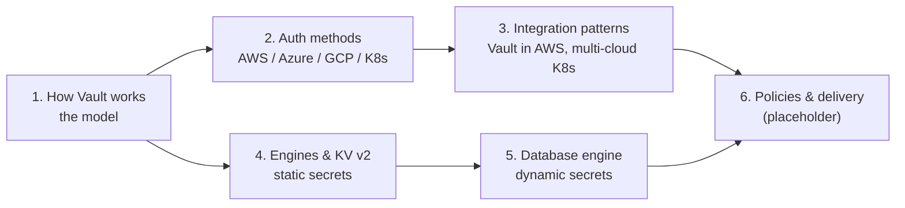
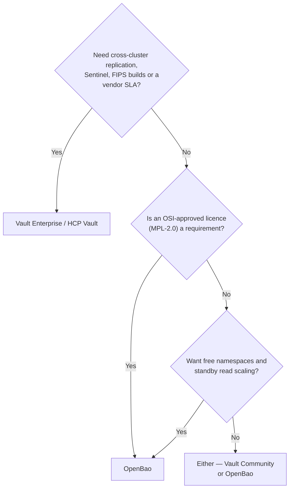

# Secrets Management with Vault / OpenBao

> A multi-part series on the **secrets platform**: how Vault (and its open-source fork,
> OpenBao) actually works, how workloads on AWS, Azure, GCP and Kubernetes prove who they
> are, how to wire one Vault into a multi-account, multi-cloud estate, and how the two
> engines you will use first — **KV v2** and **database** — behave in production.

## Who this is for

Platform and security engineers who will **own** the secrets platform: decide where it runs,
how teams onboard to it, and what happens at 3 a.m. when it is unavailable. Application
developers will get the most out of Parts 1, 4 and 5.

## Reading order

*Caption: two tracks branch from Part 1 — **identity & topology** (2 → 3) and **secrets
engines** (4 → 5). They converge in Part 6, where a workload with an identity actually
receives a secret.*

| Part | Paper | You will be able to… |
| --- | --- | --- |
| 1 | [How Vault works & why it's everywhere](./how-vault-works.md) | Explain the barrier, seal, tokens, leases and policies — and choose Vault vs OpenBao |
| 2 | [Authentication with common cloud platforms](./auth-methods-cloud.md) | Pick the right auth method for EC2/EKS, Azure, GCP, Kubernetes and CI |
| 3 | [Integration patterns](./integration-patterns.md) | Design a central Vault in AWS that serves EKS in other accounts, AKS and GKE |
| 4 | [Secrets engines & KV v2](./secrets-engines-kv2.md) | Lay out KV v2 paths, versions and policies that scale past one team |
| 5 | [Database secrets engine](./secrets-engines-database.md) | Replace shared DB passwords with short-lived, per-workload credentials |
| 6 | [Policies & delivery to apps](./policies-and-delivery.md) | 🚧 Placeholder — ACL design and getting secrets into pods |

## How this series differs from the other papers

The house style is "structure and flow, not config". This series keeps that spine — every
paper still leads with diagrams, tradeoffs and critical questions — but adds **one clearly
marked `Hands-on setup` section** per paper, because secrets engines are easiest to
understand by poking one.

:::info Conventions used in the hands-on sections
- Commands use the **`vault`** CLI. OpenBao's **`bao`** CLI takes the same subcommands and
  flags (`vault kv put` ⇢ `bao kv put`). OpenBao reads `BAO_ADDR`/`BAO_TOKEN` and also falls
  back to `VAULT_ADDR`/`VAULT_TOKEN`.
- Labs run against a **dev-mode server** (`vault server -dev`): in-memory, auto-unsealed,
  root token in your terminal. It is a learning tool — **never** a deployment pattern.
- The KV v2 and PostgreSQL labs were executed end-to-end against Vault 2.1 and PostgreSQL 16.
:::

## Vault or OpenBao? (the short version)

*Caption: for the use cases in this series (KV, dynamic DB credentials, cloud/Kubernetes
auth, Raft HA) the two are functionally interchangeable. The decision is about licence,
support and the few Enterprise-only features. Part 1 has the full comparison.*

## Planned topics (not yet written)

| Topic | Why it deserves its own paper |
| --- | --- |
| Operating Vault: HA, Raft, auto-unseal, upgrades, DR drills | Vault is tier-0 — its runbook matters more than its features |
| PKI & Transit engines | Short-lived certificates and encryption-as-a-service change app design |
| Dynamic cloud credentials (AWS/Azure/GCP secrets engines) | Removing long-lived cloud keys from CI and humans |

## Related

- Blog: [Killing long-lived credentials with workload identity](/blog/killing-long-lived-credentials)
- The *Security Plane* in [Anatomy of an Internal Developer Platform](../platform-engineering/internal-developer-platform.md)
