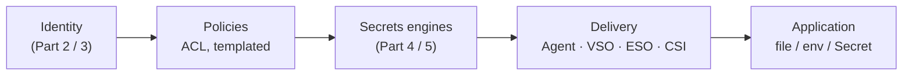

# Policies & delivery to apps

:::caution Placeholder — not written yet
This part of the series is planned. The outline below is the scope it will cover; the
earlier parts already reference it where policy design or delivery comes up.
:::

## TL;DR

Parts 2–5 give a workload an **identity** and give Vault **secrets** to serve. This paper
closes the loop: **which policies** connect the two without hand-writing one per service, and
**how the secret physically reaches the process** — a file, an environment variable or a
Kubernetes `Secret` — with renewal and rotation handled outside the application.

## Planned outline

1. **ACL policy design**
   - Capabilities, path globs (`*`, `+`) and precedence; `deny` and its pitfalls.
   - One policy per service vs **templated policies** driven by identity metadata
     (`identity.entity.metadata.*`, `identity.entity.aliases.*`).
   - Identity entities and groups across multiple auth mounts (one service, many clusters).
   - Policy as code: generating policies from the service catalog; testing them in CI.
2. **Delivery into Kubernetes**
   - Vault Agent injector (sidecar + templates), Vault Secrets Operator, External Secrets
     Operator, Secrets Store CSI driver — a comparison on etcd exposure, outage behaviour,
     rotation and ops cost.
   - Rotation without restarts: file watches, `Secret` reloaders, connection-pool refresh.
3. **Delivery outside Kubernetes**
   - Vault Agent / Proxy on VMs, CI pipelines with OIDC, serverless.
4. **Critical questions** — what happens to each delivery mode when Vault is sealed, slow or
   unreachable across clouds.

## Until then

- Delivery options are compared at a high level in
  [Part 3 — Integration patterns](./integration-patterns.md#how-it-works--one-pod-start-end-to-end).
- Path-based policy basics are in [Part 4 — Secrets engines & KV v2](./secrets-engines-kv2.md).
- [Vault policies](https://developer.hashicorp.com/vault/docs/concepts/policies) and
  [Kubernetes integration options](https://developer.hashicorp.com/vault/docs/deploy/kubernetes) in
  the upstream docs.
