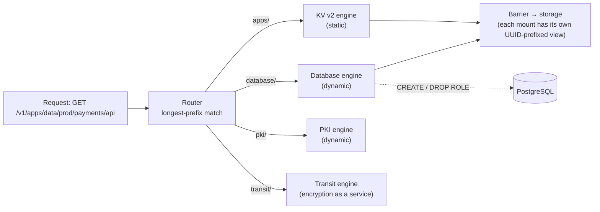
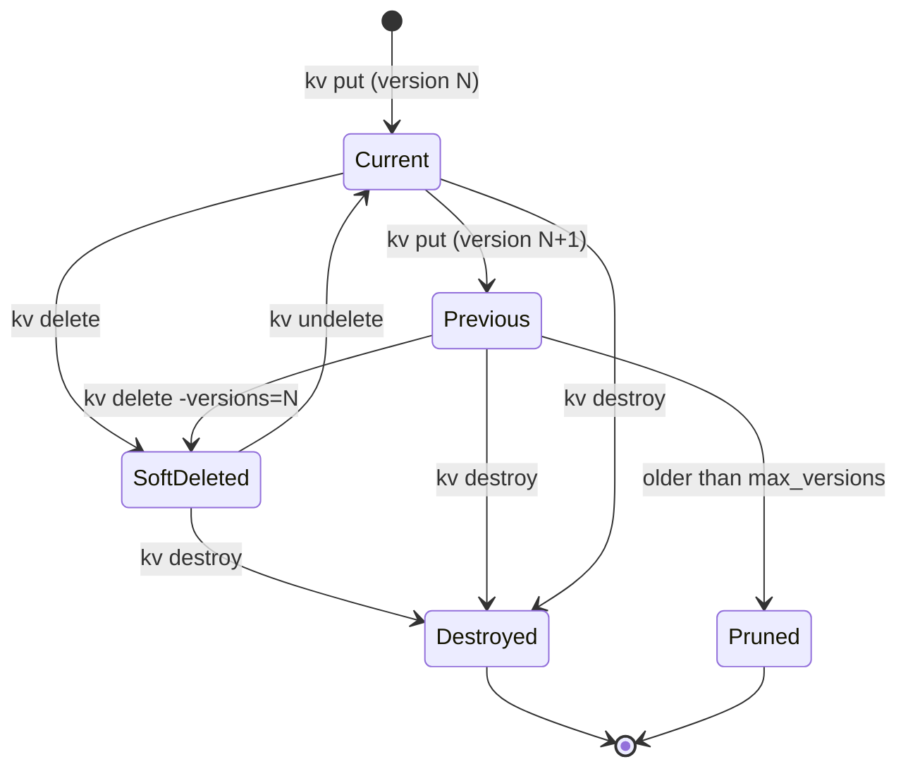
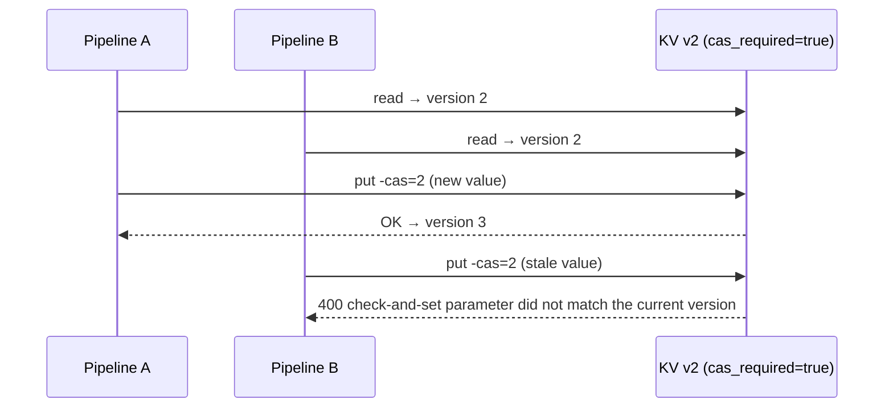
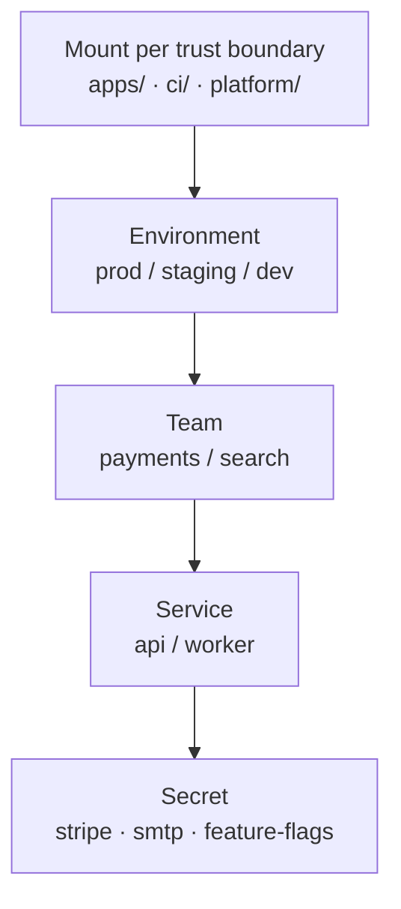

# Secrets engines & KV v2

## TL;DR

A **secrets engine** is a plugin mounted at a path; every request under that path is routed
to it. Engines come in two families: **static** (store what you give them — KV) and
**dynamic** (generate a credential on request and revoke it later — database, cloud, PKI).
**KV v2** is the static engine everyone starts with: a versioned key/value store with soft
delete, check-and-set writes and per-secret metadata. Its one gotcha is that the API paths
are **`<mount>/data/...`** and **`<mount>/metadata/...`**, and your policies must use them.

## Why it matters (platform lens)

KV v2 is where most organisations first move secrets into Vault, which means its **path
layout becomes your tenancy model** — who owns which subtree, which policy templates you
generate, how teams self-serve. A sloppy layout (`secret/stuff`, `secret/johns-test`) gets
frozen in place by hundreds of consumers. Design the tree once, on purpose.

## The Big Picture



*Caption: the mount path is just an address — you can mount the same engine type many times
(`apps/`, `team-a/`, `ci/`). Each mount gets an isolated storage view, so one engine cannot
read another's data even if it is buggy.*

| | Static engines (KV) | Dynamic engines (database, AWS, PKI…) |
| --- | --- | --- |
| Who creates the secret | A human or pipeline writes it | Vault, on each read |
| Unique per consumer | No — everyone reads the same value | **Yes** |
| Lease / revocation | No lease on KV reads | Every credential has a lease |
| Rotation | Someone writes a new version | Built in (expiry, rotate-root, static roles) |
| Use for | Third-party API keys, config you cannot generate | Anything Vault can create on the fly |

## How it works

### KV v2 paths: the API is not the CLI

The CLI hides the internal path segments; the HTTP API and **policies** do not.

| You type (CLI) | API path it hits | What lives there |
| --- | --- | --- |
| `vault kv put apps/prod/payments/api …` | `apps/data/prod/payments/api` | The secret's versions (the data) |
| `vault kv get -version=2 …` | `apps/data/prod/payments/api?version=2` | One specific version |
| `vault kv metadata get …` | `apps/metadata/prod/payments/api` | Version list, `max_versions`, `cas_required`, custom metadata |
| `vault kv list apps/prod/payments` | `apps/metadata/prod/payments` (LIST) | Child keys |
| `vault kv delete …` | `apps/data/…` (DELETE) | Soft-deletes the latest version |
| `vault kv undelete -versions=3 …` | `apps/undelete/…` | Restores soft-deleted versions |
| `vault kv destroy -versions=2 …` | `apps/destroy/…` | Permanently erases version data |
| `vault kv metadata delete …` | `apps/metadata/…` (DELETE) | Erases **all** versions and metadata |

### The life of a version



*Caption: **delete** is reversible (a deletion marker), **destroy** is not (the data is erased
but the version number stays in metadata). `kv rollback` does not rewind history — it writes
an old value as a **new** version.*

### Check-and-set: optimistic concurrency



*Caption: with `cas_required=true` on the metadata (or the mount), every write must say which
version it expects to replace. Two automations can no longer silently overwrite each other.*

## Hands-on setup

:::info Hands-on exception
Dev-mode lab. Verified end-to-end against a Vault 2.1 dev server; `bao` works the same.
:::

```bash
export VAULT_ADDR=http://127.0.0.1:8200 VAULT_TOKEN=root

# 1. Mount KV v2 at a purpose-named path (dev mode's secret/ is KV v2 too)
vault secrets enable -path=apps -version=2 kv

# 2. Per-secret settings: keep 5 versions, require check-and-set
vault kv metadata put -max-versions=5 -cas-required=true apps/payments/api

# 3. Write and version
vault kv put -cas=0 apps/payments/api stripe_key=sk_test_v1   # cas=0: only if it doesn't exist
vault kv put -cas=1 apps/payments/api stripe_key=sk_test_v2
vault kv put -cas=1 apps/payments/api stripe_key=oops         # fails: current version is 2

vault kv get apps/payments/api                                 # version 2
vault kv get -version=1 -field=stripe_key apps/payments/api    # sk_test_v1

# 4. Roll back, delete, recover, destroy
vault kv rollback -version=1 apps/payments/api                 # writes v1's data as version 3
vault kv delete apps/payments/api                              # soft-delete version 3
vault kv undelete -versions=3 apps/payments/api
vault kv destroy -versions=2 apps/payments/api                 # v2 data gone for good
vault kv metadata get apps/payments/api                        # see destroyed=true on v2

# 5. Least-privilege read policy - note data/ and metadata/
vault policy write payments-read - <<'EOF'
path "apps/data/payments/*" {
  capabilities = ["read"]
}
path "apps/metadata/payments/*" {
  capabilities = ["list"]
}
EOF

T=$(vault token create -policy=payments-read -ttl=15m -field=token)
VAULT_TOKEN=$T vault kv get -field=stripe_key apps/payments/api   # allowed
VAULT_TOKEN=$T vault kv put apps/payments/api stripe_key=hack     # 403 permission denied
VAULT_TOKEN=$T vault kv list apps/payments                        # allowed (list on metadata)
```

## Design decisions & tradeoffs

### Laying out the tree



*Caption: put the boundary that changes **policy** highest in the tree. If prod and non-prod
are governed differently, `prod/` belongs above the team, so one policy line —
`apps/data/prod/*` — can be denied to every non-prod identity.*

| Decision | Option A | Option B | Default & why |
| --- | --- | --- | --- |
| Mounts | One big `secret/` | Mount per trust boundary (`apps/`, `ci/`, `platform/`) | **Per boundary** — mount-level settings, tuning and audit separation |
| Path order | `team/env/service` | `env/team/service` | **`env/team/service`** when prod access is the strictest rule |
| Granularity | One secret with many keys | One secret per key | **Group what rotates together** — reads are per secret, versions are per secret |
| Versions | Default (10) | Low `max_versions` | **Low (3–5)** for high-churn secrets; old versions are still readable secrets |
| Concurrency | Last write wins | `cas_required=true` | **CAS on** for anything written by automation |
| Policies | Hand-written per team | **Templated** from identity (e.g. `{{identity.entity.metadata.team}}`) | **Templated** once teams exceed a handful — see Part 6 |

### KV v2 vs KV v1

| | KV v1 | KV v2 |
| --- | --- | --- |
| Versioning, undelete | ❌ | ✅ |
| Check-and-set | ❌ | ✅ |
| Custom metadata | ❌ | ✅ |
| Storage / performance overhead | Lower | Slightly higher (metadata + versions) |
| **Default** | High-volume, write-once data | **Everything else** |

## Failure modes & critical questions

- **What breaks first?** Policies written for the CLI path (`apps/payments/*`) instead of the
  API path (`apps/data/payments/*`). Everything returns 403 and the team concludes "Vault is
  broken".
- **What's the hidden cost?** KV is still **static secrets**. Moving a password from a CI
  variable into KV improves audit and access control, but not rotation. Track how many KV
  secrets have no rotation owner.
- **What assumption is load-bearing?** That old versions are harmless. They are readable
  secrets until destroyed — a "rotated" key whose previous version is still retrievable
  has not really been rotated for anyone with `read` on that path.
- **How do we know it's working?** Every KV path has an owning team (custom metadata), every
  secret has a last-rotated date, and nobody holds `path "apps/*"` in production.
- **What would make me choose the opposite?** If Vault can **generate** the credential —
  database users, cloud keys, certificates — storing it in KV is the wrong engine. Use the
  dynamic one (Part 5).

## Golden-path implementation checklist

1. Agree the **mount and path convention** (`<mount>/<env>/<team>/<service>`) and publish it.
2. Create mounts per trust boundary with sane defaults (`max_versions`, `cas_required`).
3. Generate team policies from a template — `data/` for read, `metadata/` for list.
4. Record ownership in **custom metadata** (`owner`, `rotation`, `ticket`).
5. Put KV writes behind automation (pipeline with CAS), not humans in the UI.
6. Measure: KV secrets without owner, KV secrets older than their rotation period.

## Anti-patterns / when NOT to do this

- ❌ **Policies on `secret/*`** — grants everything under the mount, including metadata delete.
- ❌ **Humans editing production secrets in the UI** — no review, no CAS, no change record.
- ❌ **Storing generated credentials in KV** — database passwords and cloud keys belong in
  dynamic engines.
- ❌ **Ten unrelated keys in one secret** — every consumer gets all ten; rotation of one bumps
  the version for all.
- ⚠️ **Skip KV v2 when** the data is high-volume and write-once (KV v1 is cheaper), or when
  you are really looking for encryption of application data (use **Transit**).

## Further reading

- [KV secrets engine v2](https://developer.hashicorp.com/vault/docs/secrets/kv/kv-v2) —
  full API, including `delete_version_after` and custom metadata.
- [Policies](https://developer.hashicorp.com/vault/docs/concepts/policies) — path matching,
  `+` and `*` globs, templated policies.
- Previous: [Part 3 — Integration patterns](./integration-patterns.md) ·
  Next: [Part 5 — Database secrets engine](./secrets-engines-database.md)
